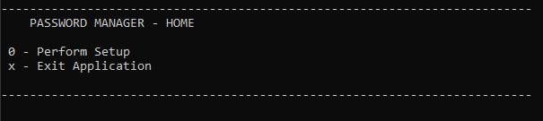
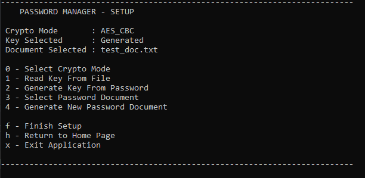
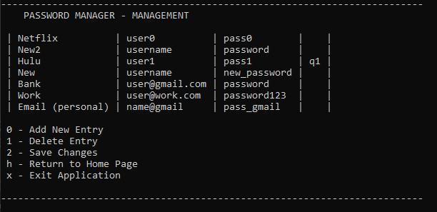

# Password Manager
## Description
Work In Progress.. A simple Password Management application and accompaning crypto library to create, view, and manage encrypted password documents. No plaintext (decrypted data) is saved on the user's filesystem, plaintext is only available in RAM and is zeroed out when finished. A console UI is currently provided with a GUI to come at a later date.
## Pre-Requisites
### Windows
Install CMake (3.16 or later) and VS 2019 (Desktop development with C++ enabled)
### Linux
Install CMake (3.16 or later) and a C++ compiler (gcc/g++)
## Building
To build the application, simply clone this repository and point CMake to the root directory
```
git clone https://github.com/JEaton97/PasswordManager.git <install_dir>
cd <build_dir>
cmake -DCMAKE_BUILD_TYPE=<Debug/Release> <install_dir>/PasswordManager
cmake --build .
```
## Usage
Once the application has built, run the PasswordManager binary produced. \
 \
The UI will prompt the user for setup information: whether to read a key from the filesystem or generate a key with password hashing, which cipher algorithm should be used, and whether to load an existing document or generate a new document. \
 \
Once setup has been completed and the correct key and cipher algorithm for the file have been selected, the decrypted contents of the file will be displayed. From here, the user can add or remove entries from the document. Note that no changes are saved unless the user explicitly requests to save changes. \

## Credits
This repository makes use of the following third party projects: \
Mbed-TLS - https://github.com/Mbed-TLS/mbedtls \
Argon2 - https://github.com/P-H-C/phc-winner-argon2 
